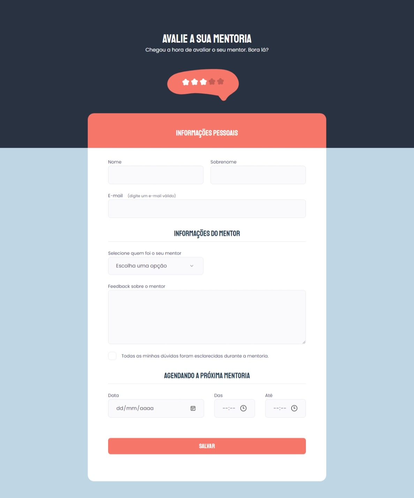

# Projeto 04 | Programa Explorer da Rocketseat

- Aprendendo sobre formulários (criação, estilização) 
- Uso de ferramentas para acessibilidade

 

[🔗 Clique aqui para acessar](https://alineviana.github.io/formularios/)

 

> ## 🖥️ Tecnologias

- HTML5  
- CSS3

 

> ### 📫 Contato

 -  
